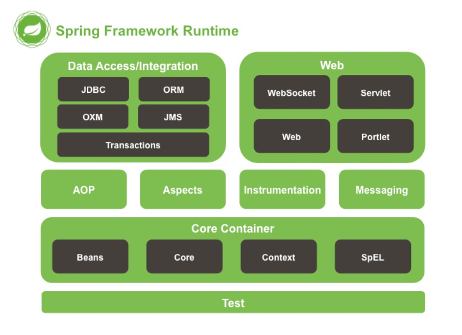

### 1.框架

### 2.Spring
容器（可以管理所有组件（类）框架；
核心关注：IOC和AOP

### 3.Spring(IOC和AOP)
`spring资料文件夹spring-framework-x.x.x.RELEASE-dist\spring-framework-x.x.x.RELEASE\libs：`
spring-aop-x.x.x.RELEASE.jar
spring-aop-x.x.x.RELEASE-javadoc.jar
spring-aop-x.x.x.RELEASE-sources.jar

三个一组：source是源码包；
参考：[Spring 4.0.0 参考文档](https://docs.spring.io/spring/docs/4.0.0.RELEASE/spring-framework-reference/htmlsingle/)

Spring模块的划分图

`Test`:单元测试模块(Spring的单元测试模块功能强大，对比junit)
`Core containrer`:核心容器(IOC)：黑色代表这部分的功能由哪些jar包组成；要使用这部分的完整功能，这些jar都需要导入
>spring-beans-4.4.0.RELEASE
spring-core-4.4.0.RELEASE
spring-context-4.4.0.RELEASE
spring-expression-4.4.0.RELEASE
`AOP+Aspects(面向切面编程模块)`

